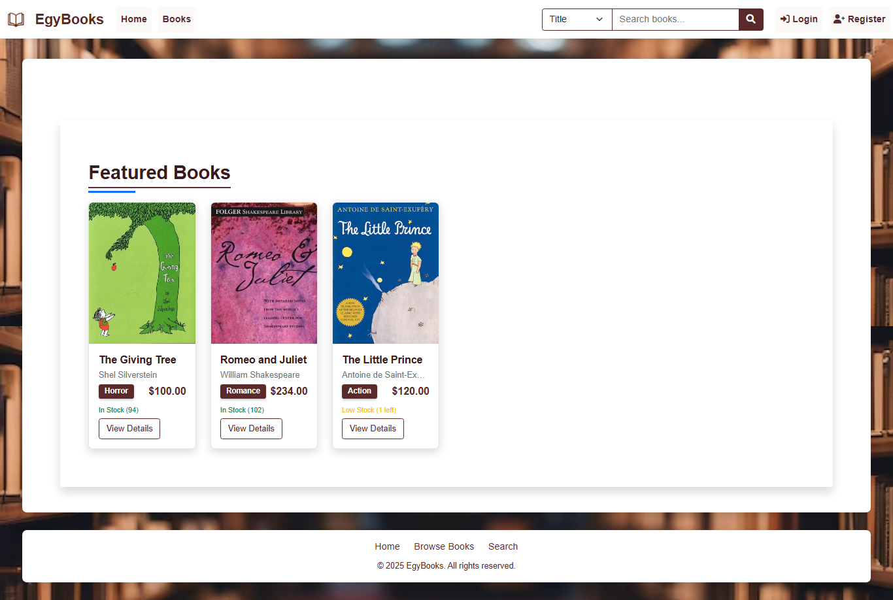

# EgyBooks - Online Library Management System

EgyBooks is a comprehensive web application for managing a digital library, built with Django backend. The application allows users to browse, purchase, borrow, and manage books with server-side data management.

## Features

- **User Authentication**: Secure login/signup system with Django's authentication
- **Book Management**: Add, edit, and delete books (admin only)
- **Shopping Cart**: Purchase or borrow books with quantity management
- **User Library**: Track owned and borrowed books with reading status
- **Responsive Design**: Works on all device sizes
- **Search & Filter**: Find books by title, author, or genre

## Usage

1. **As a regular user**:
   - Browse books in the library
   - Search for specific titles or authors
   - Add books to your cart
   - Purchase or borrow books
   - Manage your personal library and reading status

2. **As an admin**:
   - Access the admin panel at `/admin`
   - Manage all books, users, and transactions
   - Add/edit/delete books and categories

## Home Page



## Installation

### Prerequisites
- Python 3.1 or later
- pip package manager

### Setup Instructions

1. **Clone the repository**
   ```bash
   git clone https://github.com/ziadelsayedx/EgyBooks.git
   cd EgyBooks
   ```

2. **Create and activate a virtual environment**
   ```bash
   python -m venv venv
   ```
   - Windows:
     ```bash
     venv\Scripts\activate
     ```
   - macOS/Linux:
     ```bash
     source venv/bin/activate
     ```

3. **Install dependencies**
   ```bash
   pip install -r requirements.txt
   ```
   (If requirements.txt doesn't exist, install Django manually: `pip install django`)

4. **Set up the database**
   ```bash
   python manage.py migrate
   ```

5. **Create a superuser (admin account)**
   ```bash
   python manage.py createsuperuser
   ```
   Follow the prompts to create your admin account.

6. **Run the development server**
   ```bash
   python manage.py runserver
   ```

7. **Access the application**
   Open your browser and navigate to:
   ```
   http://127.0.0.1:8000/
   ```

